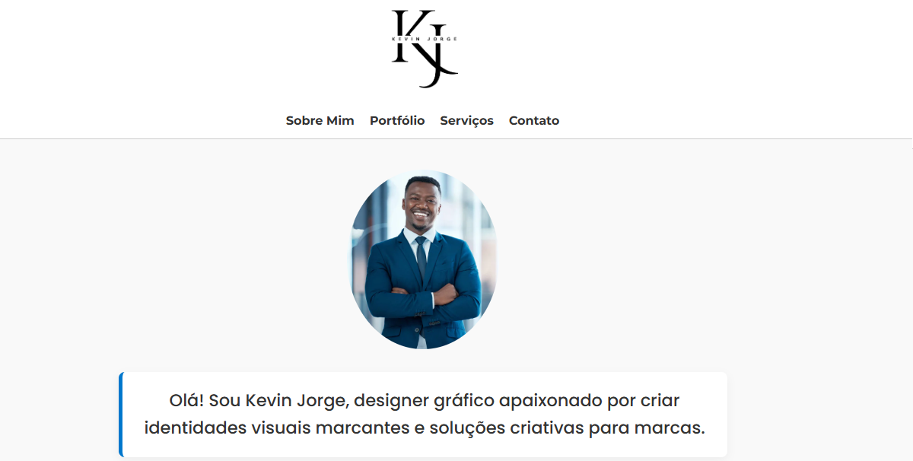
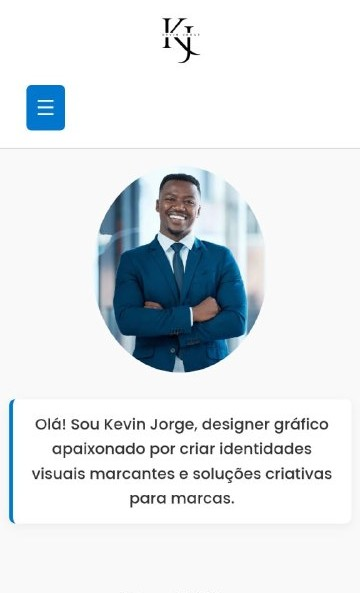

# 🚀 Portfólio Profissional — Cliente Kevin Jorge

[🇧🇷 Português](#-português) | [🇺🇸 English](#-english)

---

## 🇧🇷 Português

### 🚀 Visualização online

🔗 [Clique aqui para acessar o site](https://helensjferreira-dev.github.io/portfolio-kevin/)

### 📱 Demonstração da Interface (Desktop & Mobile)

<p align="center">
  
  <br>
  
</p>

---

### 📝 Sobre o Projeto

Este é um projeto de site estático desenvolvido sob medida para o designer Kevin Jorge. O foco principal foi a criação de uma interface moderna, rápida e totalmente responsiva, capaz de traduzir a identidade criativa do cliente para o ambiente digital.

Como desenvolvedora, este projeto me permitiu aplicar boas práticas de Front-End, garantindo que a estética e a funcionalidade caminhem juntas em um produto final otimizado.

### 📂 Estrutura de Arquivos

A organização do projeto segue padrões modernos de desenvolvimento web:

├── index.html  
├── static/  
│ ├── estilos.css  
│ ├── script.js  
│ ├── cliente0.png  
│ ├── cliente1.png  
│ ├── cliente3.png  
│ ├── cliente4.png  
│ ├── cliente5.png  
│ ├── view-desktop.png  
│ ├── view-mobile.jpg  
│ ├── foto-kevin.png  
│ ├── idvisual.png  
│ ├── logo-kevin-preto.png  
│ ├── logo-kevin.png  
│ ├── logotipo.png  
│ └── rsociais.png  
│  
├── wireframe/  
│ └── wireframe-kevin.png  
│  
├── LICENSE  
└── README.md

- **`index.html`**: Estrutura principal da página (HTML5)
- **`static/`**: Contém os arquivos de estilo (`CSS`), lógica de interatividade (`JavaScript`) e todos os recursos visuais como logotipos e imagens do portfólio.
- **`wireframe/`**: Documentação visual do planejamento e arquitetura da página.
- **`LICENSE`**: Termos de uso e distribuição do código.
- **`README.md`**: Documentação completa do projeto e guia de execução.

### 👩‍💻 Diferenciais Técnicos e Soft Skills

Diferente de um projeto estritamente acadêmico, este repositório demonstra habilidades essenciais para o mercado:

- Levantamento de Requisitos: Interpretação das necessidades do cliente para criar uma galeria dinâmica e um formulário de contato funcional.

- Acessibilidade (A11y): Implementação de navegação por teclado e compatibilidade com leitores de tela, garantindo que o portfólio seja inclusivo.

- SEO & Social Share: Configuração de Open Graph e Twitter Cards para que, ao compartilhar o link em redes sociais, o site apresente um card visual atrativo, aumentando o engajamento do cliente.

### 🛠️ Tecnologias Utilizadas

- HTML5 Semântico: Para melhor indexação em motores de busca e acessibilidade.

- CSS3 Modular: Uso de Flexbox, Grid e @keyframes para animações suaves e layout adaptável.

- JavaScript (Vanilla): Lógica para gerenciamento da galeria de projetos, modais de sucesso e validação de dados em tempo real.

### ✨ Funcionalidades Principais

- ✅ Intro Animada: Recepção visual impactante para os visitantes.

- 🖼️ Galeria Interativa. Visualização de projetos em tela cheia com descrições detalhadas.

- 📩 Formulário de Contato: Validação de campos e feedback visual instantâneo via modal de sucesso.

- 📱 Menu Mobile: Navegação intuitiva adaptada para dispositivos móveis.

- 📆 Rodapé Inteligente: Atualização automática do ano via script.

### ⚙️ Como executar localmente

1. Clone este repositório:

   ```
   git clone https://github.com/helensjferreira-dev/portfolio-kevin.git
   ```

2. Acesse a pasta do projeto:

   ```
   cd portfolio-kevin
   ```

3. Abra o arquivo index.html no seu navegador de preferência.

### 📄 Licença

Este projeto está sob a licença MIT. Veja o arquivo [LICENSE](./LICENSE) para mais detalhes.

### 👤 Autora

Hélen Ferreira Desenvolvedora Full-Stack  
📸 [Linkedin](https://www.linkedin.com/in/helensjferreira-dev/)  
💬 [WhatsApp](https://wa.me/5548988183720)

---

> Este projeto foi criado com fins de aprendizado e demonstração. Sinta-se à vontade para explorar, adaptar e contribuir!

---

## 🇺🇸 English

# 🚀 Professional Portfolio — Client Kevin Jorge

### 🚀 Online Preview

🔗 [Click here to access the live site](https://helensjferreira-dev.github.io/portfolio-kevin/)

### 📱 Interface Demonstration (Desktop & Mobile)

<p align="center">
  
  <br>
  
</p>

---

### 📝 About the Project

This is a custom-built static portfolio website developed for designer Kevin Jorge. The primary focus was creating a modern, high-performance, and fully responsive interface capable of translating the client's creative identity into the digital environment.

As the developer, this project allowed me to implement front-end best practices, ensuring that aesthetics and functionality work together in an optimized final product.

### 📂 File Structure

The project is organized following modern web development standards:

├── index.html  
├── static/  
│ ├── estilos.css  
│ ├── script.js  
│ ├── cliente0.png  
│ ├── cliente1.png  
│ ├── cliente3.png  
│ ├── cliente4.png  
│ ├── cliente5.png  
│ ├── view-desktop.png  
│ ├── view-mobile.jpg  
│ ├── foto-kevin.png  
│ ├── idvisual.png  
│ ├── logo-kevin-preto.png  
│ ├── logo-kevin.png  
│ ├── logotipo.png  
│ └── rsociais.png  
│  
├── wireframe/  
│ └── wireframe-kevin.png  
│  
├── LICENSE  
└── README.md

- **`index.html`**: Main page structure (HTML5).
- **`static/`**: Contains style sheets (`CSS`), interactivity logic (`JavaScript`), and all visual assets such as logos and portfolio images.
- **`wireframe/`**: Visual documentation of the page's planning and architecture.
- **`LICENSE`**: Terms of use and distribution.
- **`README.md`**: Complete project documentation and execution guide.

### 👩‍💻 Technical Highlights & Soft Skills

- Unlike a strictly academic project, this repository demonstrates essential market-ready skills:

- Requirements Gathering: Interpreting client needs to create a dynamic gallery and a functional contact form.

- Accessibility (A11y): Implementation of keyboard navigation and screen reader compatibility, ensuring an inclusive portfolio.

- SEO & Social Share: Configuration of Open Graph and Twitter Cards so that sharing the link on social media presents an attractive visual card, increasing client engagement.

### 🛠️ Technologies Used

- Semantic HTML5: For better search engine indexing and accessibility.

- Modular CSS3: Utilizing Flexbox, Grid, and @keyframes for smooth animations and an adaptable layout.

- Vanilla JavaScript: Logic for project gallery management, success modals, and real-time data validation.

### ✨ Key Features

- ✅ Animated Intro: An impactful visual welcome for visitors.

- 🖼️ Interactive Gallery: Fullscreen project viewing with detailed descriptions.

- 📩 Contact Form: Field validation and instant visual feedback via success modal.

- 📱 Mobile Menu: Intuitive navigation adapted for mobile devices.

- 📆 Smart Footer: Automatic year updates via script.

### ⚙️ How to run locally

1. Clone this repository:

   ```
   git clone https://github.com/helensjferreira-dev/portfolio-kevin.git
   ```

2. Navigate to the project folder:

   ```
   cd portfolio-kevin
   ```

3. Open the index.html file in your preferred browser.

### 📄 License

This project is licensed under the MIT License. See the LICENSE file for details.

### 👤 Author

Hélen Ferreira - Full-Stack Developer

📸 [Linkedin](https://www.linkedin.com/in/helensjferreira-dev/)

💬 [WhatsApp](https://wa.me/5548988183720)

---

> This project was created for learning and demonstration purposes. Feel free to explore, adapt, and contribute!

---
